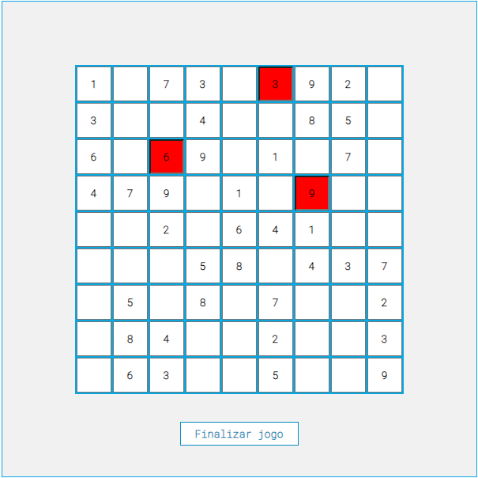

  

## Sobre

Desenvolvimento de um jogo chamado "Sudoku", para o projeto da matéria de Programação para Internet I, com o professor Marx Liden

## Tecnologias utilizadas

* HTML
* CSS
* JavaScript
* Jquery

## Como jogar 

1. Acesse o link: [sudoku-game-davirsreis.vercel.app](https://sudoku-game-davirsreis.vercel.app/)
2. Baixe o arquivo em ZIP, extraia e abra o arquivo .html com o seu navegador

